# **The Voting Station**

## **Brief**
The Voting Station is a command line interface based voting system that is built to hold an election. The election is set in Sussex and is run between three candidates: The Red, Green, and Blue Parties. The application aims to automate the voting process by collecting votes from users, storing and counting them, and then presenting data back to the user in a visually appealing way.

[Link to the live site](https://the-voting-station.herokuapp.com/)

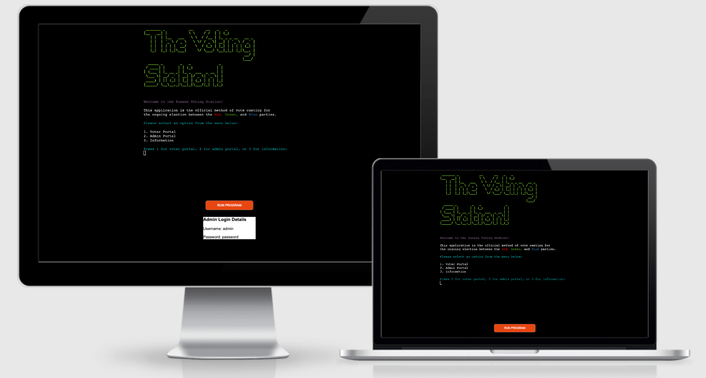

## Contents 
- [Planning](#planning)
    - [UX Objectives](#ux-objectives)
    - [Design](#design)
    - [Logic Chart](#logic-chart)
- [Features](#features)
    - [Current Features](#current-features)
    - [Future Features](#future-features)
- [Technology](#technology)
- [Testing](#testing)
    - [Validator Tests](#validator-tests)
    - [Manual Browser Testing](#manual-browser-testing)
    - [Manual Data Testing](#manual-data-testing)
    - [Browswer Compatibility](#browser-compatibility)
    - [Lighthouse Testing](#lighthouse-testing)
    - [Bugs](#bugs)
- [Deployment](#deployment)
- [Credits & Acknowledgements](#credits-&-acknowledgements)

## **Planning**
---
### **UX Objectives**
The objectives for the Voting Station from a UX perspective are:

1. Create a fluid CLI application with easy navigation and a purpose that is clear to the user from the beginning. The user knows where to go within the application and how to get there, and has no trouble in doing so.

2. The application has a consistent design that makes it clear to the user what processes are happening and when input is required. From an aesthetic perspective, the user gets a positive emotional response from interacting with the application.

3. In order to reach these objectives and achieve a high UX standard, focus needs to be put on presenting the application clearly and with a good aesthetic. This is somewhat harder in a CLI application as design is more limited, but using external modules the design can be improved and contribute to creating a good user experience.

**To achieve the first objective:**
- The inputs that control the applications flow are clearly marked, the user will always know when an action is required from them to move through the application.
- The user will always know where they are within the application, enabling them to move through it more intuitively.
- User actions are clearly explained across the application. The user will always know what will happen in response to their inputs.
- This will be complimented by consistent text colors that represent different actions: Blue text is a loading msg, cyan text indicates an input is required, and red text a warning.

**To achieve the second objective:**
- Colorama and Ascii Title will add color and design throughout, whereas without them the terminal would be limited to a black background with white text.
- Voting data will be printed into bar chart form, improving the UX by presenting data in a neat and digestible way for the user.

[Back to contents](#contents)

### **Design**
As mentioned in the UX objectives, the scope of the design is slightly limited due to being CLI based. In the planning phase, the following modules were researched and included in the project in order to maximize how much design could be added to the application:

- **Termacolor and Pyfiglet** - These modules meant that a title of Ascii text could be designed and then printed into the terminal. The title is seen throughout the application.

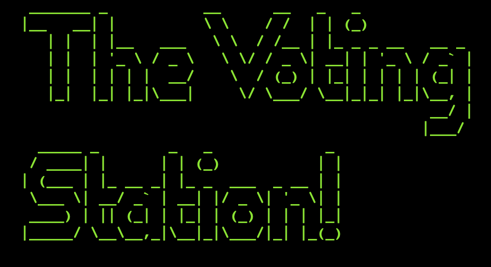

- **Colorama** - Gives color and background color to text within the application. As mentioned previously, this is useful in giving a consistent experience for the user by categorizing the text in the application to different functions and processes. For example cyan text always indicates to a user that an input is required, red text is a warning and green indicates that a user action has been accepted. As a user continues to use the application they will also build familiarity with the actions associated with the colors.

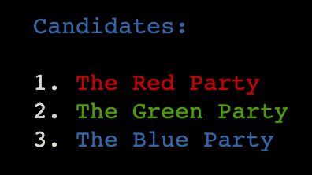

- **Plotext and Tabulate** - These modules contributed greatly in improving the design and UX in the Voting Station. They allow data to be printed into the terminal in bar chart and tabular form respectively, and meant that large swathes of data were meaningfully presented.

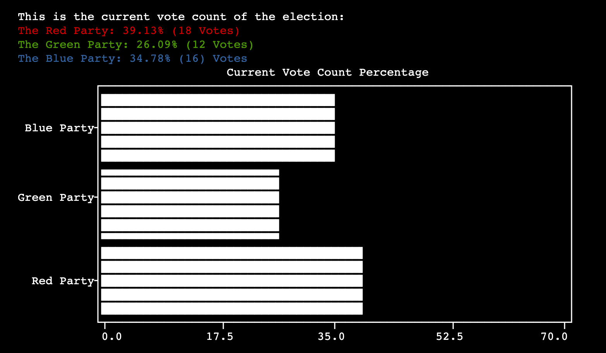

[Back to contents](#contents)

### **Logic Chart**
It was useful to map out the applications logic and functionality in order to better understand how to structure the code during development. Using Lucidchart, the application was plotted out and it proved to be a very important resource to keep referring back to during the development process. 

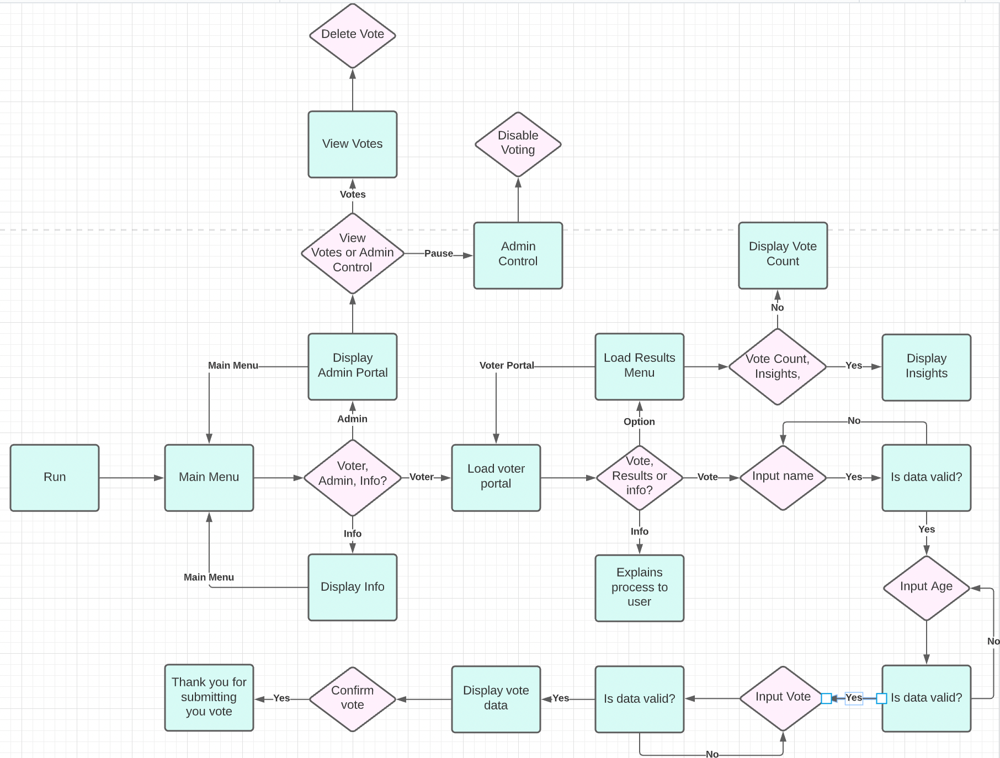

[Back to contents](#contents)

## Features
---
### **Existing Features**

#### **Vote Casting**

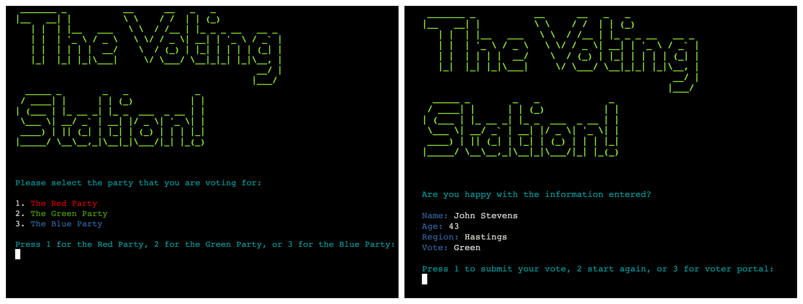

The vote casting function takes a user's vote and stores the data externally. This is the main process of the application as its principal aim is to hold an election.

- Takes first and second names, age, region, and vote, validating all inputs to ensure that the user inputs the correct data to the external google sheet.
- Allows users to review their inputs before submitting, meaning they can cancel their vote or complete the form again if they are not content.

#### **Vote Results and Insights**

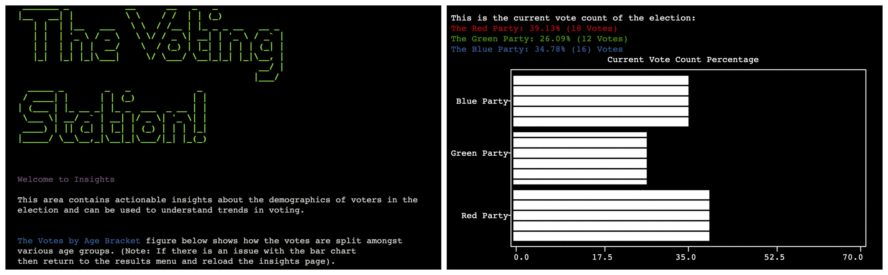
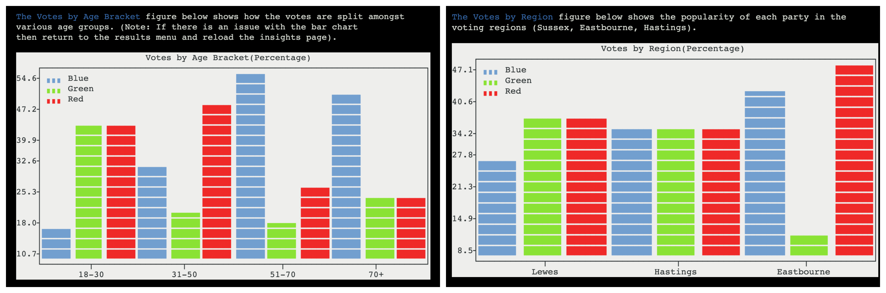

Using the data provided by the user, the Voting Station uses the plotext and gspread modules to retrieve and display the live data retrieved from the vote database.

- Vote results displays a live current vote count in percentages in bar chart format, updating automatically with each new vote.
- Voting insights provides further information about voting demographics in bar chart form, these are the popularity of each party in each voting region and the popularity of each party in certain age brackets.

#### **Information**
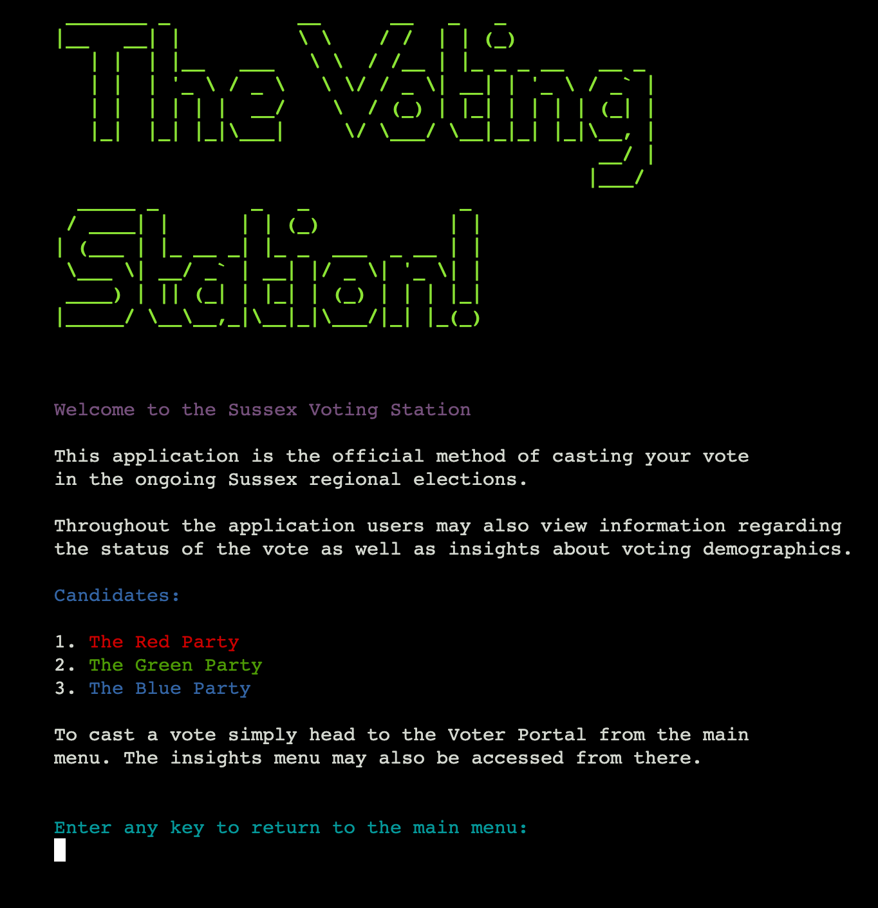

The information page explains to the user the purpose of the application and suggests possible actions that they might take.

- Clearly describes the function of the application in more depth to the user if it is not immediately obvious on the main menu.

#### **Admin Portal**

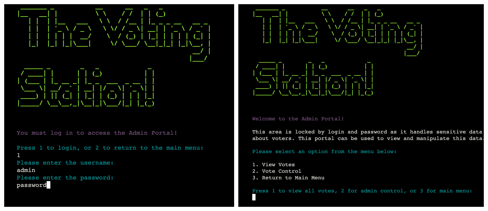
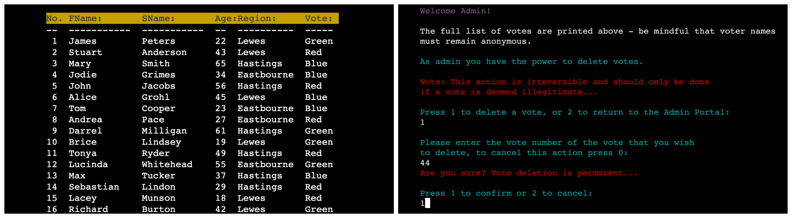

The admin portal is separated from the rest of the application as it has access to sensitive data and has powers to manipulate the vote.

- Access to the admin portal is prohibited by login and password.
- Is able to view all vote data in tabular form, including names that are omitted in other areas of the application.
- The admin can delete votes by using their index in the displayed table.
- In admin control, there is an toggle to turn off vote taking - this will prevent users from submitting votes until it is turned on again. This could be useful if there was an error with vote validation and incorrect data was being submitted.

**Admin Vote Switch:**

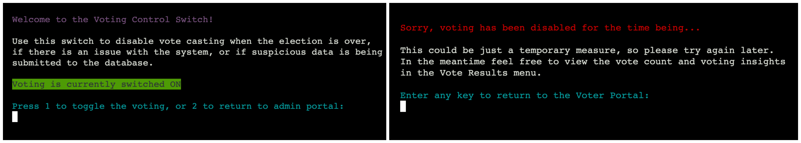

[Back to contents](#contents)

### **Future Features:**

#### **Create Custom Votes**
An idea for the future development of the Voting Station would be to give the user the ability to create separate votes for different elections of their choosing. This would involve giving full autonomy to choose what data is required to submit a vote, as well as how many candidates were taking part. 

#### **More Insights**
To build on the above idea, with more data points there would be a greater range of insights that could be drawn from an election. So automating the insights that are printed in the insights page could be an interesting idea to correlate with the different categories of data that would emerge with different elections.

[Back to contents](#contents)

## **Technology** 
---

[Back to contents](#contents)

## **Testing**

### **Validator Tests**
---

#### **Python PEP8 Validator**

All python code in the Voting Station was tested using the [**Python Pep8 Validator**](http://pep8online.com/checkresult). At the time of testing, no errors or warnings were returned. This is due to Gitpod’s built-in system that alerted any issues with the python code during development, so all issues were resolved before the application was tested in the validator.

Most issues that arose during development pertained to trailing whitespace and lines that were too long, both of which were fairly straight forward to resolve. The results from the PEP8 Validator are below:

**Run.py:**

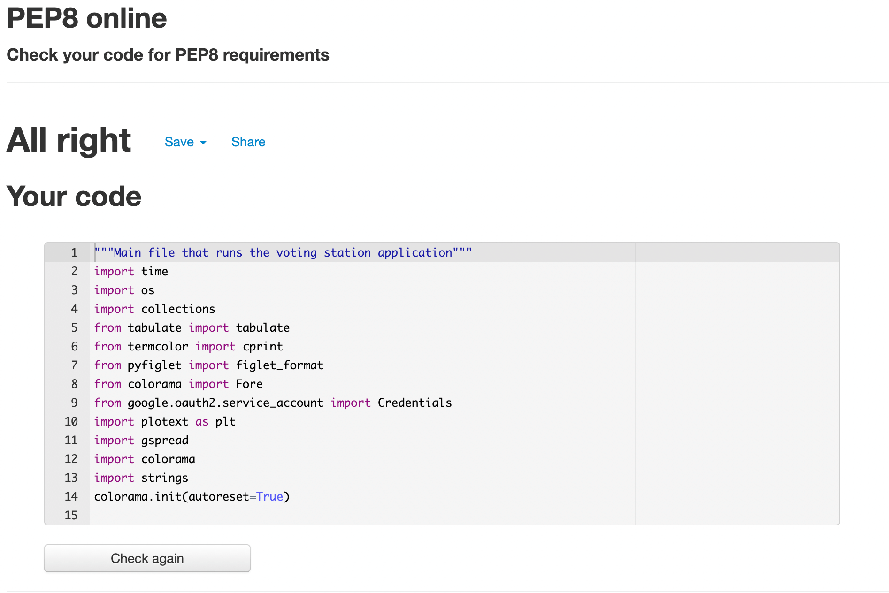

**Strings.py:**

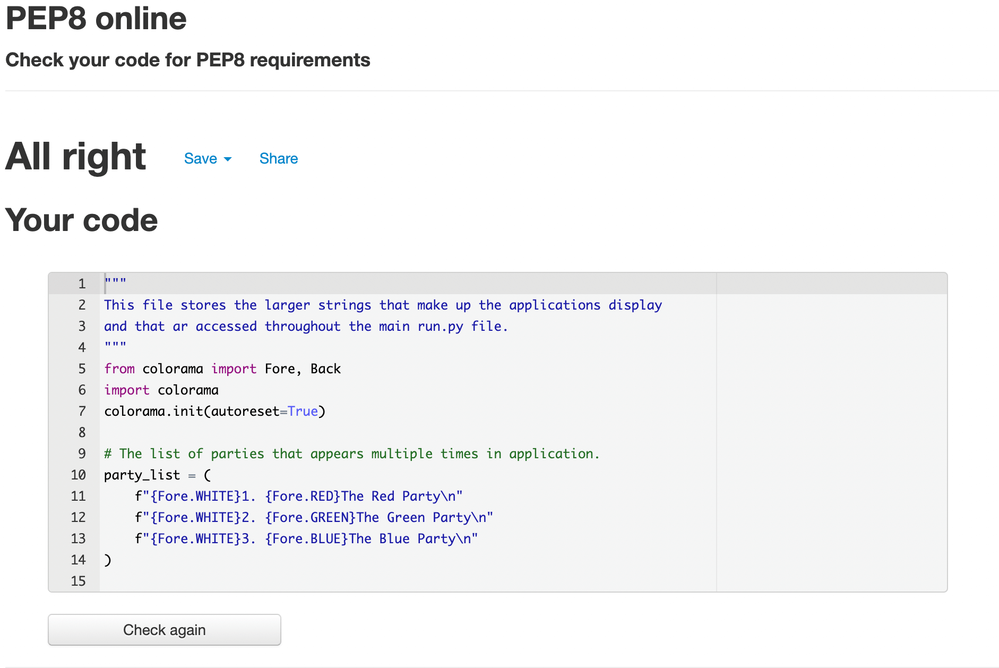

#### **HTML, CSS, and JavaScript**
As the Voting Station is developed from a template provided by Code Institute, the Javascript in the application has not been tested as no adjustments to the code have been made.

However small changes have been made to the HTML and CSS in order to format the position of the terminal in Heroku, so all HTML and CSS were passed through the [**W3C HTML Validator**](https://validator.w3.org/) and the [**Jigsaw CSS Validator**](https://jigsaw.w3.org/css-validator/) respectively.

**For HTML**:

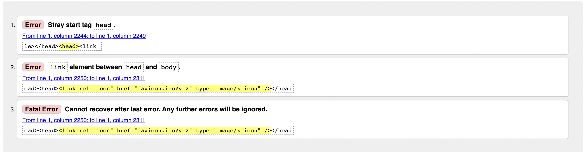

The validator initially returned three errors, including a fatal error. These were all related to the placement of the site favicon in the wrong html file. All of these errors were removed when the favicon was moved to the head of the layout.html file.

The passed validator test is below:

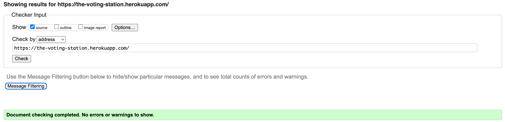

**For CSS**:

CSS validation unsurprisingly returned no errors as the alterations to the code were very minor:

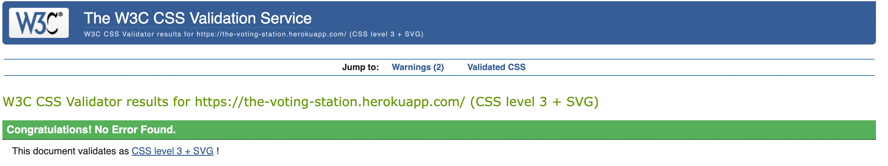

[Back to contents](#contents)

### **Manual Input Testing**
The Voting Station relies on user input for the application to function correctly. In order to fully test for issues, each input across the interface was individually tested to find any errors that might occur and also to ensure that any actions resulting from an input worked as intended.

This was done by inputting all incorrect data types - strings, numbers, negative numbers, empty inputs, misplaced capitalisation, misplaced spaces - in each input to try and beat the validation in the code. The result from each input was also double checked to ensure that the outcome of every user response was the correct action.

The results are below:

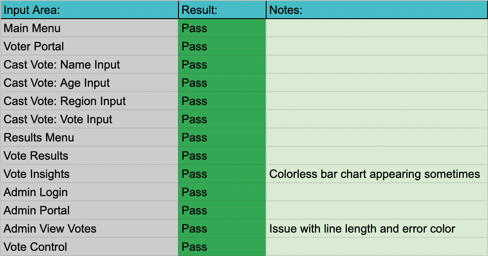

All input validation and functionality worked as expected, and no incorrect data types are able to compromise the application and pass through voting.

The only issues found when testing were related to the color of a warning when deleting a vote being incorrect which was resolved, and also the first bar chart in insights rendering incorrectly. This second issue is a known bug, although navigating back to the voter portal and then back into insights will load the chart successfully.

[Back to contents](#contents)

### **Manual Data Testing** 
To check that the data being presented in the bar charts was correct, manual tests were also conducted. This involved counting each vote using google sheets and ensuring that it matched up to the data in the Current Vote Count, also calculating the percentage and ensuring that it matched up.

With the insights page, bar charts were made within google sheets to compare the data generated by python and ensure that it was correct.

[manual data testing img]

[Back to contents](#contents)

### **Browser Compatibility** 
The Voting Station has been tested across multiple browsers:

- **Chrome**
- **Mozilla Firefox**
- **Safari**
- **Opera**

The only issue found during browser testing was in Safari, where the opening input would not allow any keyboard entry, effectively freezing the application before it had begun. This issue occurred on a 2021 Macbook, but testing Safari on a different 2015 model did not recreate the error. On the older macbook the application ran exactly as intended, this could indicate that the issue is to do with either the newer machine or a newer version of Safari and not the code itself.

In all other browsers the application functioned exactly as anticipated, all user interaction was successful, and the google sheet was always updated appropriately.

[Back to contents](#contents)

### **Lighthouse Testing**
The Voting Station was tested using the Lighthouse extension of Google Chrome, the results are below:

**Mobile:**

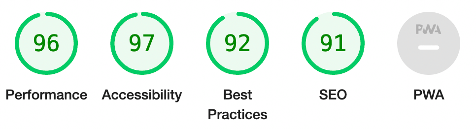

**Desktop:**

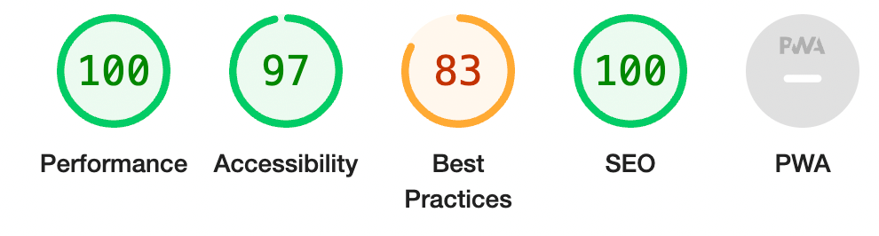

The SEO score was originally lower due to the site not having a meta description so adding one seemed to resolve the score. The other low score was in Best Practices. This issue was related to the JavaScript library involved, which as mentioned earlier was preinstalled with the template.

[Back to contents](#contents)

### **Bugs**

#### **Resolved**

**Clearing Terminal**
An issue that was particularly difficult to resolve in the beginning of Heroku was related to clearing the terminal. Using the OS module there is a function to clear the terminal, however this is seemingly limited to the viewport size of the terminal itself and therefore with larger amounts of content that would exceed the terminal height, the function would not fully clear the terminal. This was eventually resolved thanks to a fellow student Helena on slack having the same issue and who found a solution:

**Favicon**
A persistent problem faced throughout the application development was the favicon not displaying in Heroku. This can be seen throughout the commit history where repeated attempts are made to resolve the issue as in order to test a solution, the changes had to be pushed to Github. Eventually changing the link to the favicon from a file path to a raw link solved the issue.

#### **Unresolved**

**First Insights Bar Chart**
The largest unresolved bug in the application is an error with one of the bar charts in the insights area of the application. Upon loading, the chart does not plot data and instead prints a colorless square with no discernible information on it - this seemingly occurred on every instance that the insights page was loaded for the first time. However, by exiting the insights page and loading it once again the bar chart would print as expected. Whilst not totally resolved, adding a timer between the calling of the two bar chart functions has managed to prevent the issue happening as regularly as before, but sometimes it still occurs. In this case, the user is instructed to reload the insights page.

**Double Barrel Names**
It was realized quite late into the project development that whilst the name validation is effective in preventing incorrect inputs by preventing special characters and spaces, problems can be caused for users with two first names or double barreled surnames that require hyphens or spaces.  This is cause for improvement in future development of the project.

**Bad UX**
There are also a couple of examples of bad UX which result from the application being based in the CLI. These occur in the admin votes table and the insights page, where due to larger amounts of content being printed, the user is dragged down to the bottom of the console and half of the content is cut off by the terminal. These do not affect the functionality of the application, but still require the user to scroll up to read the data where it would be preferable if the data fit into the terminal.

[Back to contents](#contents)

### **Deployment**

[Back to contents](#contents)

### **Credits & Acknowledgments**

[Back to contents](#contents)
